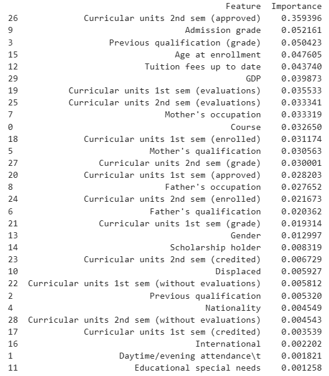
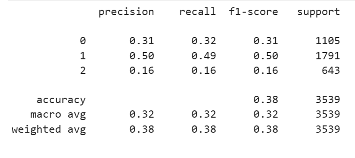

# Capstone-Project

## Education Success Rates based on Various factors

#### This is a Machine Learning Model which predicts whether a student would achieve success or dropout from academics in his/her coming future.

This project will explore the significance that specific demo-
graphic, geographic, psychographic, and financial factors have on a stu-
dent’s academic performance by looking at data sources that show the
academic performance of several students in relation to the mentioned
factors. This project will use data analysis, data cleaning, and predictive
models to determine how a student will do based on these factors

 Author: Naiema Elsaadi
 Date: November 21, 2023 
 Northwestern Missouri State University, Maryville MO 64468, USA

## Table of Contents

- [Overview](#overview)
- [Prerequisites](#prerequisites)
- [How to Run](#how-to-run)
- [Project Structure](#project-structure)
- [How It Works](#how-it-works)
- [Screenshots](#screenshots)

## Overview

This project focuses on Education. Education is often the most important pillar of success in the world today. Success in the classroom can be a good indicator of future success in employment, as well as be the beginning of a life of financial fulfillment. The data problems that this project hopes to analyze, are the factors that lead to student success in school vs the factors that lead to failure in school. This is significantly important in today’s world, because education is proven to be very important in the future success of most people. This Project will attempt to highlight the main factors that lead to student success and student failures, so that people can be more aware of them.

This repository contains the code, data, and documentation for the Education Success Analytics project. The project aims to analyze factors influencing education success rates using a dataset obtained from Kaggle.

## Data Sources
The dataset that is used for this project was found through Kaggle, a
popular platform for datasets. This dataset will provide information on Student
Performance in schools, GPAs, ACTs, Drop out rates, as well as information
on financial situation of students, geographic, demographic, and psychographic
information on students and their families. 
 <b> Source Data for csv file:</b>

https://www.kaggle.com/datasets/naveenkumar20bps1137/predict-students-dropout-and-academic-success?select=dataset.csv

## Prerequisites

<b>Before running the project, ensure you have the following prerequisites:</b>

- Git
- Github
- Python 3.10+ installed
- anaconda prompt (miniconda3)
- jupyter lab
- The following modules are used in this project:
 csv
 pip install -r requirements.txt
 source .venv/bin/activate
 .venv\Scripts\activate
 fastapi
 pandas
 scikit-learn
 uvicorn
- Required Python Importing Libraries
 import pandas as pd
 import numpy as np
 import matplotlib.pyplot as plt
 import seaborn as sns
 import matplotlib.cm as cm
 import matplotlib as mpl
 import warnings 
 warnings.filterwarnings('ignore')
 from sklearn.model_selection import train_test_split
 from sklearn.ensemble import RandomForestClassifier
 from sklearn.tree import DecisionTreeClassifier
 from sklearn import svm 
 from sklearn.ensemble import AdaBoostClassifier
 from sklearn.neural_network import MLPClassifier
 from sklearn.linear_model import LogisticRegression
 from sklearn.metrics import accuracy_score, precision_score, recall_score, f1_score, confusion_matrix, classification_report
 from sklearn.metrics import accuracy_score
 from sklearn.metrics import classification_report
 from sklearn.preprocessing import LabelEncoder
 from sklearn.metrics import roc_auc_score, precision_score, recall_score, accuracy_score, f1_score, roc_curve
 from sklearn.metrics import accuracy_score, confusion_matrix, classification_report
 %matplotlib inline

## How to Run

<b>Follow these steps to run the project:</b>

1. Clone the repository to your local machine:
2. Navigate to the project directory:
3. Open anaconda prompt (miniconda3) and clone your file by cd and copy your path  :
4. Run jupyter lab  
5. Explore the notebooks, scripts, and data folders for detailed insights into the project.
6. Refer to the README.md for additional information.
5. Start your coding to do the project:
 – Phase 1: Acquire Data source
 – Phase 2: Data Preprocessing and Cleaning
 – Phase 3: Exploratory Data Analysis
 – Phase 4: Designing Predictive Models
 – Phase 5: Building Predictive Models
 – Phase 6: Model Evaluation
 – Phase 7: Final Model Selection
 – Phase 8: Results and Discussion
 – Phase 9: Conclusion
 – Phase 10: Limitations and Future Work

## Overleaf Report

The detailed report for this project is available on Overleaf. You can access it and viewed on [here](https://www.overleaf.com/read/sgvfbcrvqqhn#c4ef91).

## Key Computational Resources
- [Pandas Documentation](https://pandas.pydata.org/pandas-docs/stable/)
- [Scikit-Learn Documentation](https://scikit-learn.org/stable/documentation.html)
- [Matplotlib Documentation](https://matplotlib.org/stable/contents.html)

## Project Structure

<b>The project structure is organized as follows:</b>
-  **data :** Contains the dataset used in the project (data.csv).
- **notebooks:** Jupyter notebooks for data analysis and modeling.
- 1_Exploratory_Data_Analysis.ipynb: Notebook for exploratory data analysis.
- 2_Data_Cleaning_and_Feature_Engineering.ipynb: Notebook for data cleaning and feature engineering.
- 3_Modeling.ipynb: Notebook for applying machine learning models.
- **scripts:**  Python scripts for specific tasks.
- **model_training.ipynb:** Script for training machine learning models.
- **Reports:** [Overleaf Report](https://www.overleaf.com/read/sgvfbcrvqqhn#c4ef91)
- **text_workbooks:** txt workbooks used for data exploration and analysis.
- **photos.png:**  Screen suts for results 
- **README.md:** The main documentation file that introduces the project, explains the structure, and provides relevant links.

## Screenshots

## How It Works

 
 

## Output and Results
1. Extract and display feature importances and visualizea feature importance with a bar plot
 

2. Classification Report

3. Correlation of each feature

4. Visualizing the combined ROC curves 

## Conclusion
This README.md serves as a guide to navigate through the project. For detailed analysis, findings, and visualizations, please refer to the Overleaf report linked above.

Feel free to reach out for any questions or clarifications.

**My name is Naiema Elsaadi**
 **My email adrees is s556619@nwmissouri.edu**

## Reference

1. Horton, J.: Identifying at-risk factors that affect college student success.
International Journal of Process Education 7(1), 83–101 (2015)
2. Kuh, G.D., Kinzie, J.L., Buckley, J.A., Bridges, B.K., Hayek, J.C.: What matters
to student success: A review of the literature, vol. 8. National Postsecondary
Education Cooperative Washington, DC (2006)
3. Kumar, K.N.: Predict students’ dropout, academic success.
https://www.kaggle.com/datasets/naveenkumar20bps1137/
predict-students-dropout-and-academic-success?select=dataset.csv
(2021), (accessed: 2023-10-22)
4. Shah, N.S.: Predicting factors that affect students’ academic performance by using
data mining techniques. Pakistan business review 13(4), 631–638 (2012)

